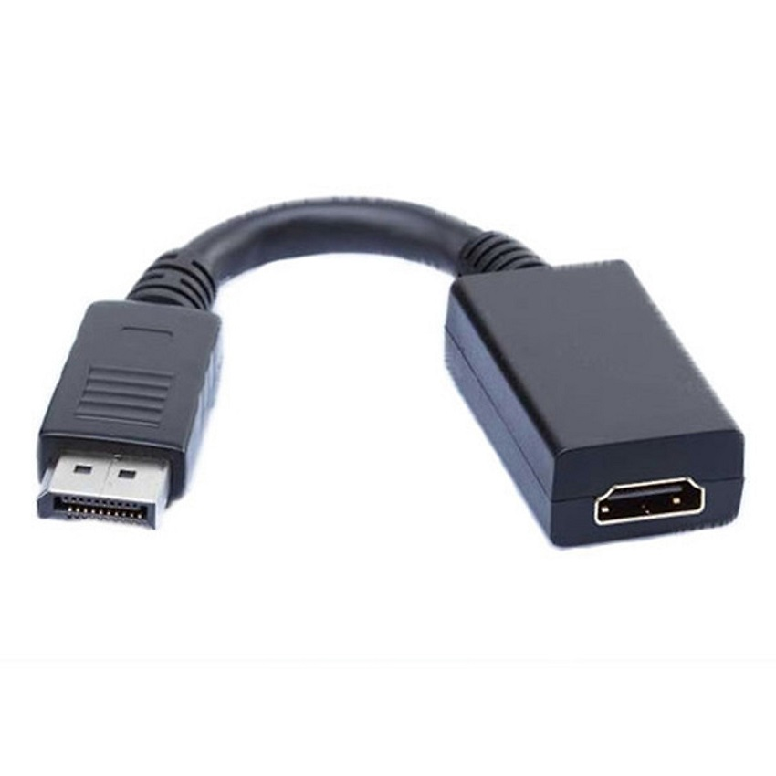
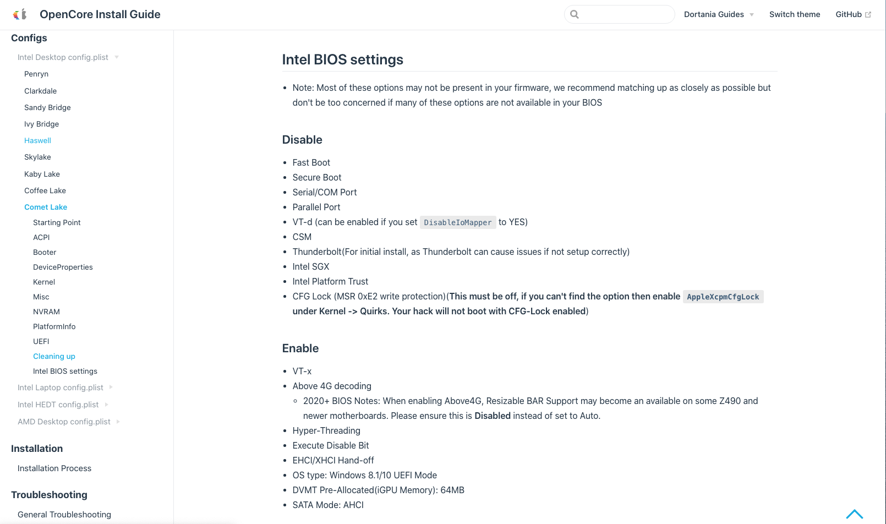
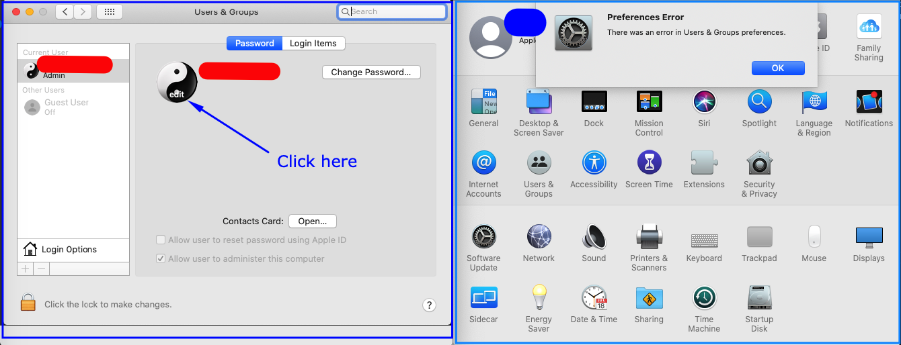
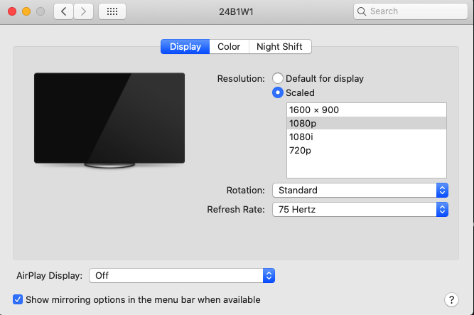

# GIGABYTE-B460M-AORUS-PRO-i3-10105-iGPU-UHD630

## Hardware

| Configuration    | Model  |
| ---------------- | ------ |
| CPU              | i3 10105 |
| Motherboard      | GIGABYTE B460M AORUS PRO (rev. 1.0) |
| Graphics card    | Intel® UHD Graphics 630 |
| RAM              | G.SKILL Ripjaws V 1x8GB 2800 MHz |
| Disk             | SSD KINGSTON A2000 250GB M.2 NVMe |
| Monitor          | 2* AOC 24B1XH5 24" IPS 75Hz FHD |
| WiFi adapter     | USB TP-Link TL-WN725N Wireless N150Mbps |

Because Motherboard only support 1 gate HDMI, 1 DP, 1 DVI. So i must using adapter convert from DP to HDMI for second screen

## CPU Support

- [x] Supports all 10-generation CPUs with UHD630 cores e.g: i3 10100, i5 10400, i5 10500...
- [x] The 10th generation CPU of non-core display with F can also have the following independent display without drive (but cannot use nuclear display acceleration)

## GPU Support

- [x] Support UHD630 graphics card with only CPU core display
- [x] Support AMD RX 470/480/570/570X/580/580X/590 series graphics cards. See also other hackintosh with this configuration [Here](https://github.com/giapdong/Hackintosh-Gigabyte-B460M-AORUS-PRO-i3-10100F-RX570)
- [x] Support AMD RX 5500/5600/5700 series graphics cards (dedicated config.plist required)
  > PS: To use the independent display, you need to forcibly turn on the CPU core display in the BIOS (Advanced -> Built-in display configuration -> Integrated graphics multi-monitor (IGD Multi-monitor) -> Allow), otherwise the core display hardware decoding will fail and only use the core Obviously can be ignored

## EFI

OpenCore: 0.6.9

macOS version: 10.15.7 (19H15)

EFI download link: [Download](https://github.com/giapdong/Hackintosh-B460M-AORUS-PRO-i3-10105-iGPU-UHD630/releases)

## BIOS Settings

I used default setting for Commet Lake in OpenCore guide.

## Issues

| Summary | Illustrator | Description |
|---------|--------|-------------|
| Cannot change avatar of User or Apple ID |  | Goto System Preferences > Users & Groups > Click to user in left sidebar > Hover to avatar in screen then click edit |
| Cannot install Firefox | | I cannot install Firefox browser all version |
| Cannot using built-in screen record | | Built-in screen record opened with CMD + SHIFT + 5 not work for me |
| Cannot install OBS Studio | | I cannot install OBS Studio for screen record |
| Using 2 screen |  | If you using 75Hz screen, must change to 75Hz in System Preferences > Displays |

## WiFi

I using `USB TP-Link TL-WN725N Wireless N150Mbps`, you can follow official guide [Here](https://www.tp-link.com/support/download/tl-wn725n/) or download in releases of this repo [Here](https://github.com/giapdong/Hackintosh-B460M-AORUS-PRO-i3-10105-iGPU-UHD630/releases)